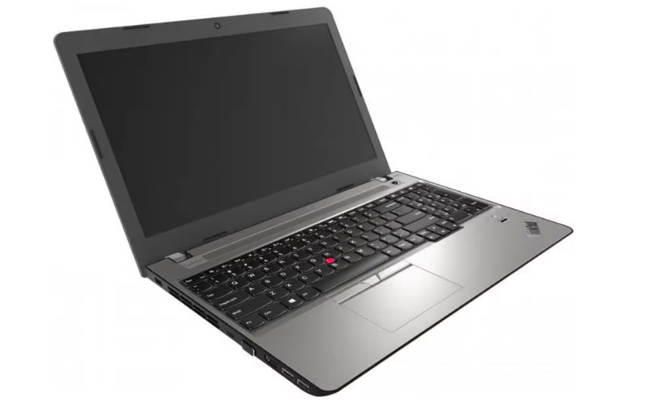
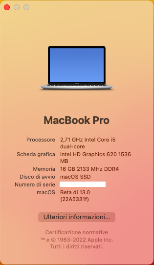
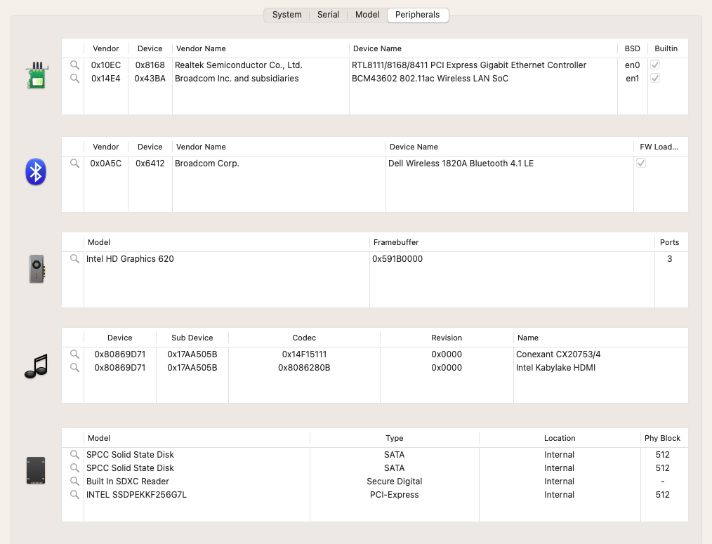
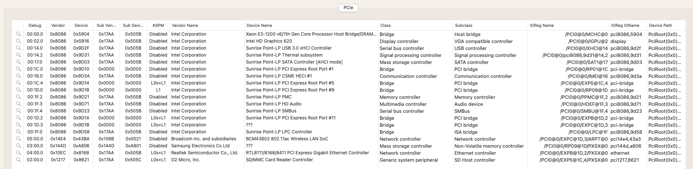
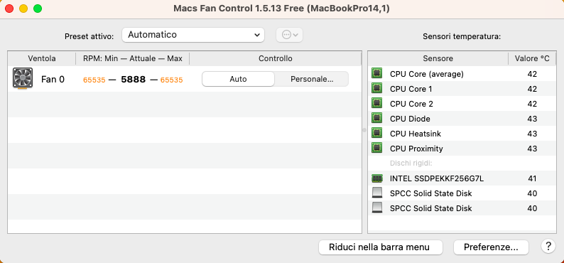
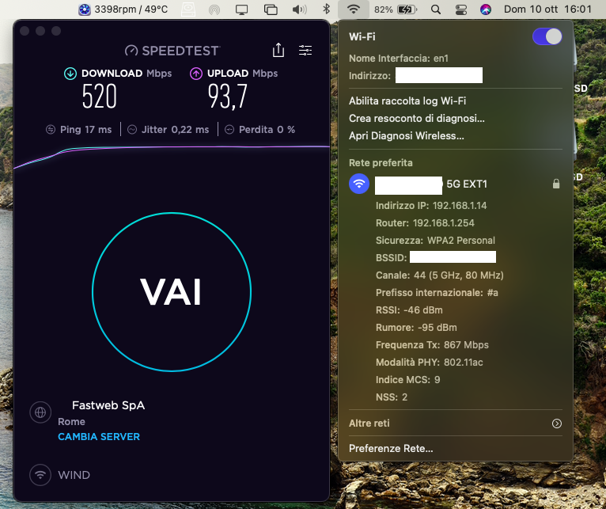
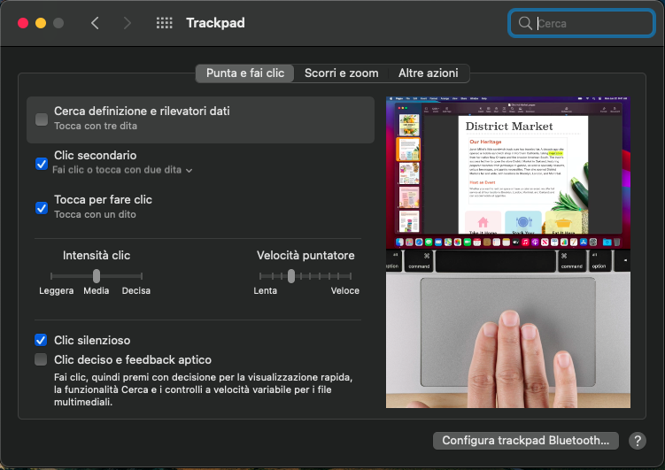
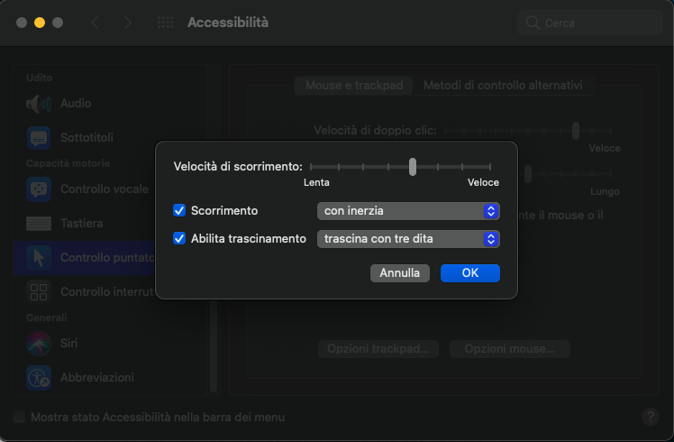
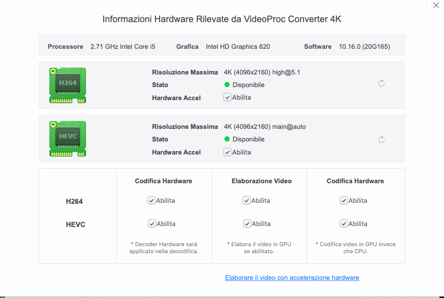

# Lenovo ThinkPad E570 (Kaby Lake) Hackintosh

EFI for enovo ThinkPad E570 with OpenCore bootloader

### Computer Spec:

| Component        | Brank                              |
| ---------------- | ---------------------------------- |
| CPU              | Intel i5 7200U (2C-4T 3MB KBL)     |
| iGPU             | Intel® HD 620 Graphics             |
| Lan              | Intel I219-LM                      |
| Audio            | Realtek ALC256                     |
| Ram              | Crucial 16 GB DDR4 2133 Mhz        |
| Wifi + Bluetooth | BCM94350ZAE (DW1820A)              |
| NVMe             | SAMSUNG 980 500 GB (MACOS+WIN 11)  |
| SmBios           | MacBookPro 14,1                    |
| BootLoader       | OpenCore 0.8.3                     |
| macOS            | Ventura 13 beta 6                  |

### What works and What doesn't or WIP:

- [x] Intel HD 620 iGPU eDP with Backlight Output
- [x] Intel HD 620 iGPU HDMI Output 
- [x] Intel HD 620 iGPU Type-C to HDMI Output
- [x] Intel HD 620 iGPU - H264 & HEVC
- [x] ALC256 Internal Speakers
- [x] ALC256 Internal microphone
- [x] ALC256 Combojack headphones
- [x] ALC256 Combojack microphone
- [x] ALC256 HDMI Audio Output
- [x] ALC256 TYPE-C to HDMI Audio Output
- [x] All USB-A 3.1 Ports (TYPE-C 3.1 Included)
- [x] SpeedStep / Sleep / Wake
- [x] HID Key PWRB & SLPB 
- [x] SYNA Touchpad with gesture + TrackPoint
- [x] Keyboard (PS2-Internal) with backlight
- [x] Brightness Key
- [x] F11 Print Screen Key
- [x] F1 & F2 & F3 Sound Key
- [x] Wi-Fi and Bluetooth BCM94352Z (DELL DW1560) Module
- [x] Lan Intel I219-LM
- [x] SSD NVME Slot-1 PciE
- [x] Micro SD Cardreader
- [x] WebCam (USB-Internal)
- [x] All Sensors CPU, IGPU, BATTERY, NVME, FAN
- [x] ACPI Battery
- [x] NVRAM (Native)
- [x] Recovery (macOS) boot from OpenCore
- [x] Windows 11 boot from OpenCore

## Peripherals & TouchPad Setting & Benchmarks

### Special Config:

- Usb port mapping performed (with port HS08 for touchscreen model)
- SSDT-Hack Essential patch

### Post Install:

Open terminal and run install.sh from TOOLS EFI MOD/ComboJack_Installer. After reboot insert jack and appears this image

See [ioreg](./MacBook%20Pro%2014%2C1.zip) for more clarification

### MacOS bootable USB creation:
- Read the Dortania guide for creating your USB from Windows or macOS
- [Guide Dortania](https://dortania.github.io/OpenCore-Install-Guide/installer-guide/) - USB creation

## Bios settings
### Enable :
* Integrated NIC : Enable

### Disable : 
* Secure Boot
* Absolute
* Intel SGX
* Enable UEFI Network Stack

### Working all NATIVE-SHORTCUTS-APPLE:

## Credits

- [Apple](https://apple.com) for macOS.
- [Acidanthera](https://github.com/acidanthera) for OpenCore and all the lovely hackintosh work.
